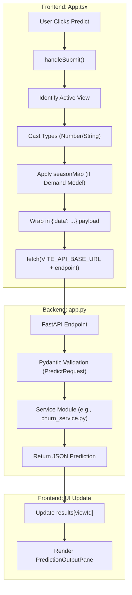
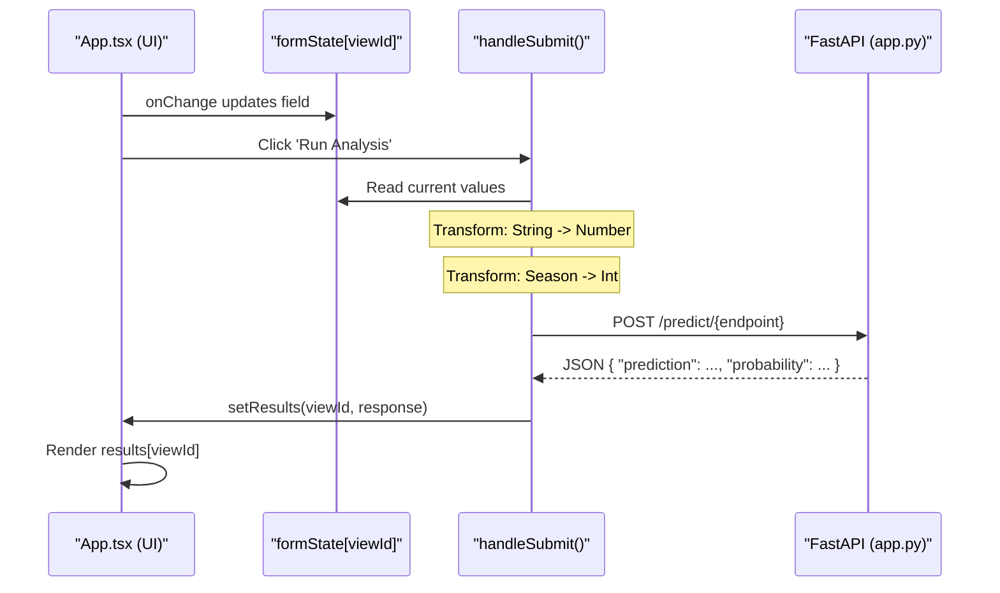

# App Component & Inference Workflow
Relevant source files
- [frontend/src/App.tsx](https://github.com/Kranthikumar06/Tekworks-Team3-project/blob/c4d76b47/frontend/src/App.tsx)

The `App` component in `frontend/src/App.tsx` serves as the central orchestrator for the Intellix Premium UI. It manages the application state, defines the metadata-driven UI for seven distinct machine learning models, and implements a complex inference lifecycle that bridges user input to backend FastAPI endpoints.

## View Configuration & Metadata

The application utilizes a metadata-driven approach to render model workspaces. Each workspace is defined as a `ViewConfig` object, which contains metadata for the sidebar, form fields, and endpoint mapping.

### Key Types

- **`FieldGroup`**: Defines a logical grouping of input fields with a title and an array of individual field configurations (e.g., `select`, `number`, `text`). [frontend/src/App.tsx112-124](https://github.com/Kranthikumar06/Tekworks-Team3-project/blob/c4d76b47/frontend/src/App.tsx#L112-L124)
- **`ViewConfig`**: The primary configuration object for a model workspace. It includes the `id`, `title`, `icon`, `endpoint`, and the `groups` of fields required for the model. [frontend/src/App.tsx126-136](https://github.com/Kranthikumar06/Tekworks-Team3-project/blob/c4d76b47/frontend/src/App.tsx#L126-L136)

### The `views` Registry

The `views` registry is a memoized array containing the configuration for all seven predictive models. This registry allows the UI to dynamically generate forms and handle submissions based on the active view. [frontend/src/App.tsx142-632](https://github.com/Kranthikumar06/Tekworks-Team3-project/blob/c4d76b47/frontend/src/App.tsx#L142-L632)

| Model Workspace | Endpoint | Key Features |
| --- | --- | --- |
| **Churn Prediction** | `/predict/churn` | 19 input parameters across 4 groups. [frontend/src/App.tsx151-271](https://github.com/Kranthikumar06/Tekworks-Team3-project/blob/c4d76b47/frontend/src/App.tsx#L151-L271) |
| **Subscription Renewal** | `/predict/subscription` | Focuses on tenure and contract type. [frontend/src/App.tsx273-334](https://github.com/Kranthikumar06/Tekworks-Team3-project/blob/c4d76b47/frontend/src/App.tsx#L273-L334) |
| **Market Response** | `/predict/market_response` | Includes campaign and demographic data. [frontend/src/App.tsx336-403](https://github.com/Kranthikumar06/Tekworks-Team3-project/blob/c4d76b47/frontend/src/App.tsx#L336-L403) |
| **Product Demand** | `/predict/product_demand` | Time-series forecasting inputs. [frontend/src/App.tsx405-455](https://github.com/Kranthikumar06/Tekworks-Team3-project/blob/c4d76b47/frontend/src/App.tsx#L405-L455) |
| **Product Sensitivity** | `/predict/product_sensitivity` | Dynamic pricing parameters. [frontend/src/App.tsx457-526](https://github.com/Kranthikumar06/Tekworks-Team3-project/blob/c4d76b47/frontend/src/App.tsx#L457-L526) |
| **Purchase Propensity** | `/predict/purchase_propensity` | Customer attribute analysis. [frontend/src/App.tsx528-587](https://github.com/Kranthikumar06/Tekworks-Team3-project/blob/c4d76b47/frontend/src/App.tsx#L528-L587) |
| **Customer Segmentation** | `/predict/customer_segmentation` | Behavioral clustering inputs. [frontend/src/App.tsx589-631](https://github.com/Kranthikumar06/Tekworks-Team3-project/blob/c4d76b47/frontend/src/App.tsx#L589-L631) |

**Sources:**[frontend/src/App.tsx112-632](https://github.com/Kranthikumar06/Tekworks-Team3-project/blob/c4d76b47/frontend/src/App.tsx#L112-L632)

## State Management

The application maintains a centralized state to track user inputs, inference results, and UI status.

- **`activeViewId`**: Tracks the currently selected model workspace (defaults to 'about'). [frontend/src/App.tsx640](https://github.com/Kranthikumar06/Tekworks-Team3-project/blob/c4d76b47/frontend/src/App.tsx#L640-L640)
- **`formState`**: A nested object keyed by `viewId`, storing the current input values for every field in every model. This ensures that user progress is preserved when switching between tabs. [frontend/src/App.tsx643-646](https://github.com/Kranthikumar06/Tekworks-Team3-project/blob/c4d76b47/frontend/src/App.tsx#L643-L646)
- **`results`**: Stores the backend response for each view, keyed by `viewId`. [frontend/src/App.tsx649](https://github.com/Kranthikumar06/Tekworks-Team3-project/blob/c4d76b47/frontend/src/App.tsx#L649-L649)
- **`loading`**: A boolean flag to trigger UI loading states (e.g., the radar scanner animation). [frontend/src/App.tsx650](https://github.com/Kranthikumar06/Tekworks-Team3-project/blob/c4d76b47/frontend/src/App.tsx#L650-L650)

**Sources:**[frontend/src/App.tsx640-652](https://github.com/Kranthikumar06/Tekworks-Team3-project/blob/c4d76b47/frontend/src/App.tsx#L640-L652)

## Inference Lifecycle (`handleSubmit`)

The `handleSubmit` function is the core logic for executing model inference. It transforms the raw React state into the specific format required by the FastAPI backend.

### Workflow Steps

1. **Serialization & Type Casting**: Iterates through the `ViewConfig` for the active view. It converts string inputs from HTML forms into numbers if the field type is `number`. [frontend/src/App.tsx691-700](https://github.com/Kranthikumar06/Tekworks-Team3-project/blob/c4d76b47/frontend/src/App.tsx#L691-L700)
2. **`seasonMap` Transformation**: For the "Product Demand" model, it maps human-readable seasons (e.g., "Spring") to their corresponding integer values required by the model. [frontend/src/App.tsx702-710](https://github.com/Kranthikumar06/Tekworks-Team3-project/blob/c4d76b47/frontend/src/App.tsx#L702-L710)
3. **Data Wrapping**: For most models, the payload is wrapped in a `data` key to match the `PredictRequest` Pydantic schema in the backend. The "Market Response" model is an exception and sends a flat object. [frontend/src/App.tsx714-716](https://github.com/Kranthikumar06/Tekworks-Team3-project/blob/c4d76b47/frontend/src/App.tsx#L714-L716)
4. **Fetch Execution**: Sends a POST request to the backend using the `VITE_API_BASE_URL`. [frontend/src/App.tsx720-724](https://github.com/Kranthikumar06/Tekworks-Team3-project/blob/c4d76b47/frontend/src/App.tsx#L720-L724)
5. **Error Handling**: Catches network errors or non-200 responses, triggering the `showToast` system. [frontend/src/App.tsx734-738](https://github.com/Kranthikumar06/Tekworks-Team3-project/blob/c4d76b47/frontend/src/App.tsx#L734-L738)
6. **Post-Processing**: Updates the `results` state with the prediction and clears the loading flag. [frontend/src/App.tsx726-731](https://github.com/Kranthikumar06/Tekworks-Team3-project/blob/c4d76b47/frontend/src/App.tsx#L726-L731)

### Inference Flow Diagram

**Sources:**[frontend/src/App.tsx684-740](https://github.com/Kranthikumar06/Tekworks-Team3-project/blob/c4d76b47/frontend/src/App.tsx#L684-L740)

## Utility Functions

### Export Functionality (`handleExport`)

The `handleExport` function triggers the browser's print dialog (`window.print()`). The application uses specific CSS `@media print` rules defined in `App.css` to hide the sidebar and navigation elements, ensuring only the prediction report is printed. [frontend/src/App.tsx675-677](https://github.com/Kranthikumar06/Tekworks-Team3-project/blob/c4d76b47/frontend/src/App.tsx#L675-L677)

### Toast Notification System

A custom notification system is implemented using the `toast` state. The `showToast` helper creates a temporary message (success or error) that disappears after 3 seconds. [frontend/src/App.tsx653-662](https://github.com/Kranthikumar06/Tekworks-Team3-project/blob/c4d76b47/frontend/src/App.tsx#L653-L662)

### Form Reset

The `handleReset` function allows users to clear the `formState` for the current view, reverting all inputs to their default empty strings. [frontend/src/App.tsx679-682](https://github.com/Kranthikumar06/Tekworks-Team3-project/blob/c4d76b47/frontend/src/App.tsx#L679-L682)

## Data Flow: State to API

The following diagram illustrates how internal code entities interact to move data from the UI to the ML models.

**Sources:**[frontend/src/App.tsx643-740](https://github.com/Kranthikumar06/Tekworks-Team3-project/blob/c4d76b47/frontend/src/App.tsx#L643-L740)[frontend/src/App.tsx885-920](https://github.com/Kranthikumar06/Tekworks-Team3-project/blob/c4d76b47/frontend/src/App.tsx#L885-L920)